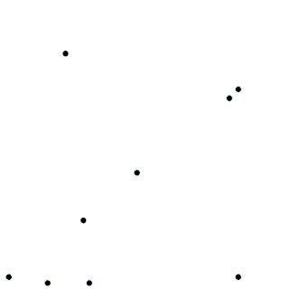

### Algorithmic Form

Algorithmic design -- collaborating with an AI partner in the design process -- is in many ways [the future of design](https://medium.com/startup-grind/design-in-an-age-of-artificial-intelligence-739e656b44ba).

The fundamentals of designing with and for an AI often requires a very specific goal due to the [lack of better tools](https://autodeskresearch.com/projects/dreamcatcher), similar to designing with evolutionary solvers. The fuzzy difference is that, in an evolutionary solver, we are working towards an *unknown* goal wherein the computational model can learn about the problem as it operates. In an algorithmic form generation model, we are applying a set of rules -- or patterns -- intelligently but consistently to an input, quite literally *processing* our design intent. In this way, the output is the result of recognizable patterns, and is often more predictable (but *more performative*) that an evolved form. Often, the pattern that is applied can be an [emergent pattern](https://medium.com/ai-first-design/ai-first-exploring-a-new-era-in-design-25be2b9920c), recognized and encoded by another AI combing through a dataset looking for similarities, patterns, and other relationships. 

In this example, Grasshopper is used as an AI to pseudo-intelligently remove material from a surface to produce a skeletal form. The particular algorithm that we will be applying is the commonly used Voronoi pattern. Our input object will be a surface generated in Rhinoceros 3D, and the AI will carve away material so that a functional structure remains.

The [Voronoi algorithm](https://en.wikipedia.org/wiki/Voronoi_diagram) is a very simple pattern, which uses proximity to a cloud of points to partition either a plane or a volume into segments. The segments include all of the physical space that is closer to each point in the cloud than any other point. The Voronoi algorithm was [discovered and codified] at the end of the 20th century, yet nevertheless continues to find [new uses in algorithmically modeling](https://en.wikipedia.org/wiki/Voronoi_diagram#Applications) human population behaviors, bone growth, weather patterns, and all kinds of other natural and artificial phenomena.

In object design, Voronoi logic introduces several compelling properties. 
- Voronoi cells offer an easily manufacturable model for an organic aesthetic.
- The edges of the Voronoi diagram are the best levers for supporting weight, offering robust sturctural properties with minimal material use
- The flexibility of the Voronoi pattern allows for natural density gradients, producing unusual moire effects when stacked and natural falloffs in surface patterning.
- 3D Voronoi cells offer unusual, though predictable, acoustic and raybouncing properties that are still not fully understood yet nevertheless offer compelling amplification properties for designers of lighting and sonic systems.

You will need to install Weaverbird, a mesh editing plugin for Grasshopper to complete this exercise.

[Weaverbird for Windows](http://www.giuliopiacentino.com/weaverbird/)
[Weaverbird for Mac](http://www.giuliopiacentino.com/get-wb-no-admin/)

Install these into the `Components` folder of your Grasshopper installation and restart Rhino.

