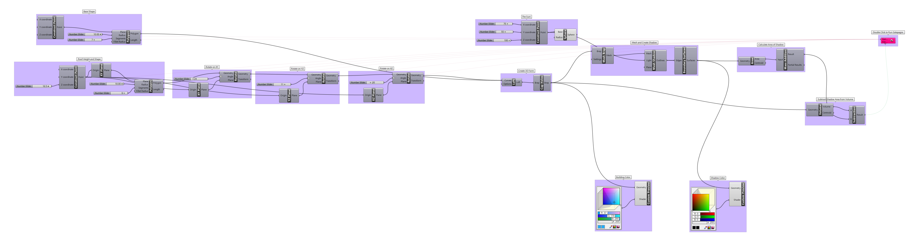

### Evolutionary Modeling

This example Grasshopper model uses [evolutionary solving algorithms](https://en.wikipedia.org/wiki/Evolutionary_algorithm), which simulate Darwinian evolution and genome mutation to optimize a formal result.

[Solar Carve](solar_carve.gh)

Take a look at Studio Gang's in construction [Solar Carve Tower](http://www.archdaily.com/806233/new-images-of-studio-gangs-solar-carve-tower-revealed-as-project-gets-underway) to see these techniques applied.

Also, play around with a tremendous time waster -- [box car 2d](http://boxcar2d.com/) 

