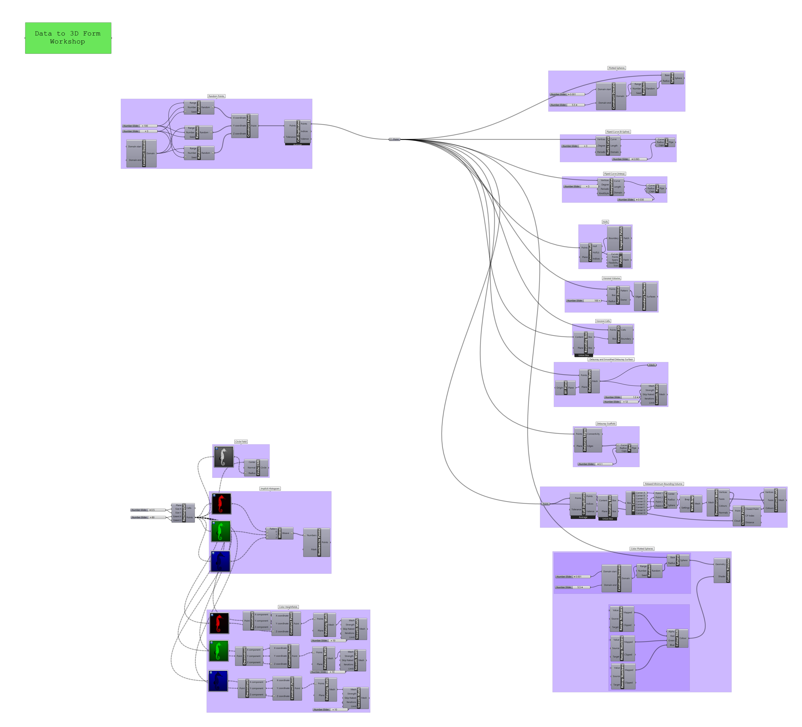

### Sample Data Forms

Grasshopper 3D is a powerful tool for modeling with information and algorithmic logic, in 3D.

This sample file contains many methods for creating forms from random data points.

[Data Samples](data_form_sample.gh)

