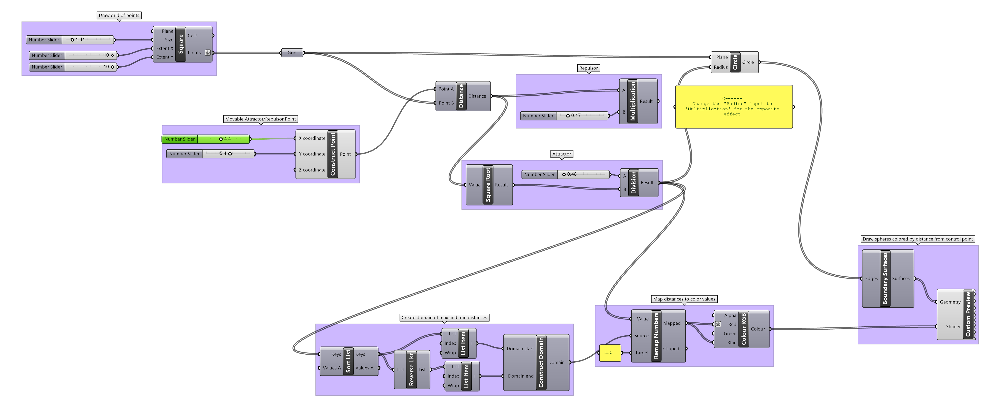

### Attractor / Repulsor Points

[Point Attraction](ar.gif)

It is often helpful to be able to deform multiple geometries smoothly dependent on some falloff. This demonstration exercise draws circles with a radius dependent on distance from a control point.

- Draw grid of points
- Draw control point
- Calculate euclidean distance between control point and all grid points
- Do some math on distance to better map values to desired radii (note that closeness can either *shrink* or *grow* circles depending on the formula applied)
- Draw circle at each grid point

[Download the definition](attractorpoint.gh)

