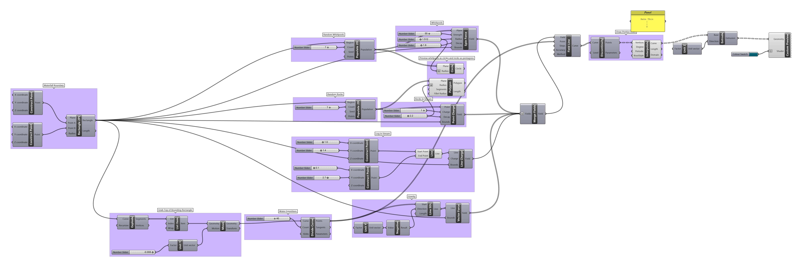

### Field Lines 

[Field analysis and field lines](https://en.wikipedia.org/wiki/Field_line) serve as computational simulations for many natural phenomena including fluid flow, magnetic and electric behaviors, vector computation, erosion, and kinetic particulates like fireworks and fine powder dispersion. We can also use this logic to create forms that are reflective of motion and obstructition. 

Grasshopper offers helpful utilities for field analysis and visulatization.

This setup attempts to simulate a waterfall.
- A boundary rectangle is drawn
- The top edge of the boundary rectangle is divided into many parts to serve as water emmitters
- A vector force pulls water down from the emmitters, simulating the force of gravity
- Random point charges emulate rocks obstructing the stream
- Random spin charges simulate whirlpools and splashing water
- A controllable line charge simulates a log obstructing the flow of the stream
- All of the charges are merged into a single field for Grasshopper to analyze
- Regularly spaced lines are drawn to visualize the field at various points.

[Download the definition](waterfall.gh)

