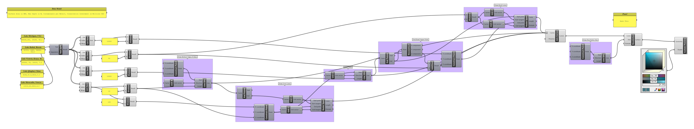

### Parametric Drinkware

Let's use data about the world's lakes, pulled from [World Lake Database](http://wldb.ilec.or.jp) to produce drinkware forms.

- Import the Data into panels
- Draw curves using `LineSDL`, `End Points`, and `Bezier Span` to construct the wine glass profile
- Create a `Revolution` surface by drawing an axis of rotation line
- Play with the data and add other lakes!

[Download the definition](lakeglass.gh)

