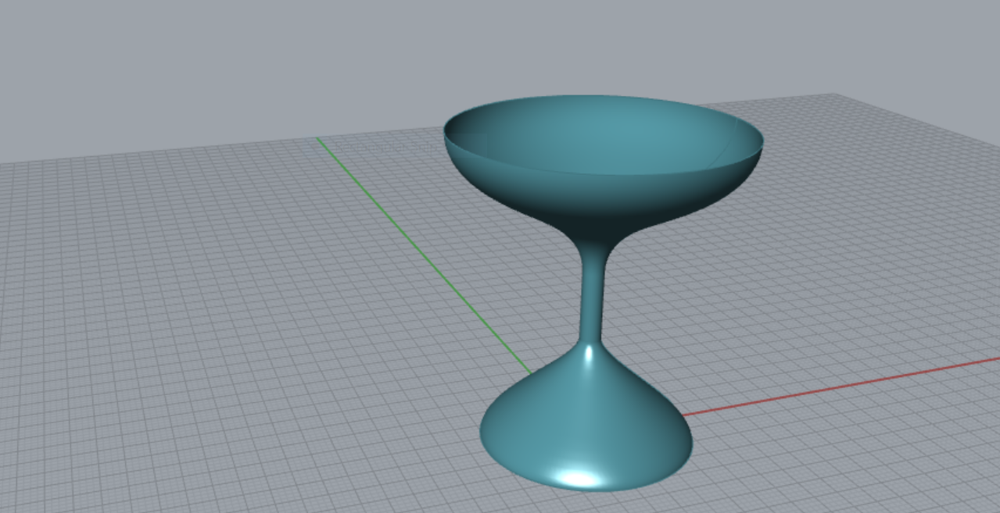

### Parametric Drinkware



Let's use data about the world's lakes, pulled from [World Lake Database](http://wldb.ilec.or.jp) to produce drinkware forms.

Lake Michigan
```
58030,281,28180,43.2 
```

Lake Baikal
```
31722,1642,36000,24.6
```

Lake Victoria
```
68800,83,18010,7.2
```

Lake Qinghai
```
4186,32.8,5810,3.2
```

Lake Maracaibo
```
13210,60,8900,4.2
```

- Import the Data into panels
- Draw curves using `LineSDL`, `End Points`, and `Bezier Span` to construct the wine glass profile
- Create a `Revolution` surface by drawing an axis of rotation line
- Play with the data and add other lakes!

[Download the definition](lakeglass.gh)

