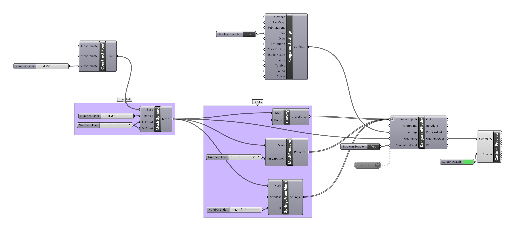

### Physics Solvers

- Go to Food4Rhino, make an account, and download [Kangaroo Physics v0.99](http://www.food4rhino.com/app/kangaroo-physics#downloads_list)
- Install it in Grasshopper 'Special Folders' (In Grasshopper, navigate to File->Special Folders->Components)
- Restart Rhino

- Have fun with Physics!

[Download the Definition](basicphysics.gh)

