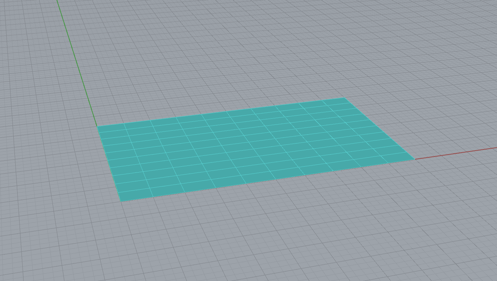
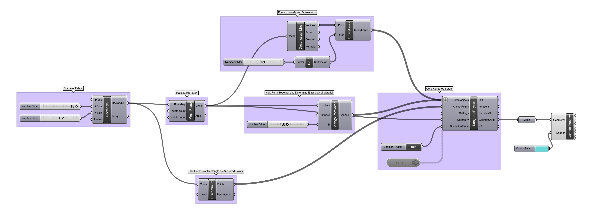

### Elastic Catenary Forms

This definition stretches a patch of material with a single, directional force and allows for elastic distension, [letting the material settle to an equilibirum](https://en.wikipedia.org/wiki/Catenary). This type of physical force and transformation is often used by architects and designers to determine the minimal support necessary for structure, as well as for [general form finding](https://www.designboom.com/design/studio-glithero-lost-time-for-perrier-jouet-at-designmiami/). The Catalan architect [Antoni Gaudi)(https://en.wikipedia.org/wiki/Antoni_Gaud%C3%AD) is well known for using catenary forms in his works, espeically the [Sagrada Familia](https://en.wikipedia.org/wiki/Sagrada_Fam%C3%ADlia).

[Download the definition.](catenary.gh)

