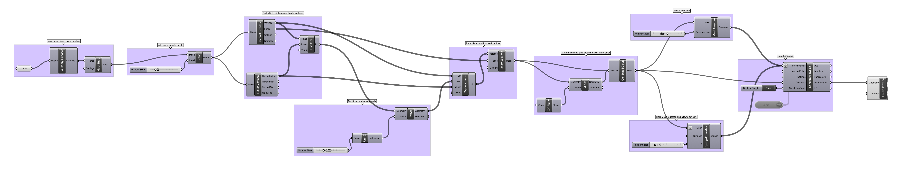

### Inflating a Mesh

Forces exerted inside a hollow, flexible object equally produces what we recognize as inflation. [Inflatable structures](https://en.wikipedia.org/wiki/Inflatable_building) continue to be essential for space travel and other extreme environments, as well as for children's toys (a common combination!).

[Download the definition](inflate.gh)

