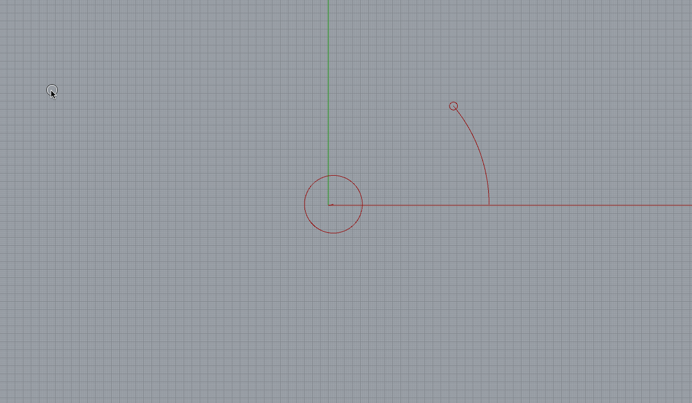
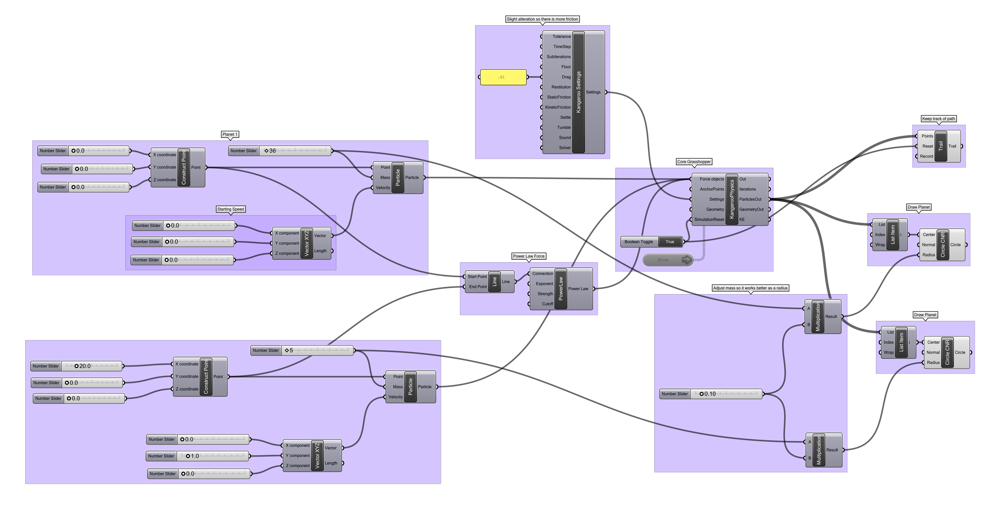

### Orbiting with Power Law Force

The [power laws]() are equations that relate the ideal attraction or repulsion between two bodies to their masses, positions, and velocities. Kangaroo can generate such forces, and as a result orbital mechanics and astronomical harmonics can be used to [produce patters and trajectories](http://www.artbylogic.com/parametricart/spirograph/spirograph.htm).

[Download the definition.](orbit.gh)

