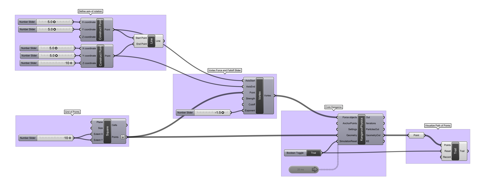
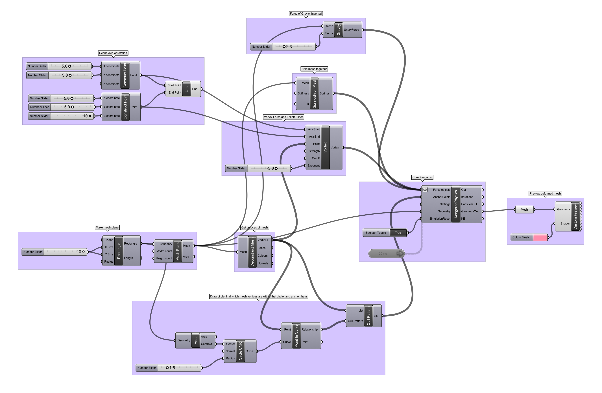

### Vortex Force Twisting

Vortex forces apply irregular torque to objects in 3 dimensions, rotationally around an axis. 

[Download the definition.](vortextrail.gh)

-----

The same force, applied to a mesh plane, distorts an object with a twist.

[Download the definition.](vortextwist.gh)

