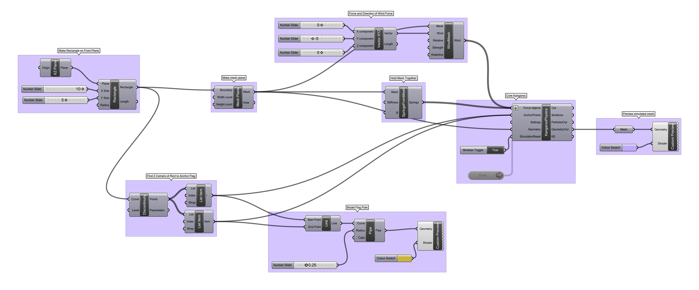

### Softbody Simultion with Wind

The force of wind, a variably directional force that smoothly reorients over time, is available in Kangaroo to simulate fluid motion. Designers like [Martin Knapek](http://knapek.org/windcuts2/windcuts.html) and [Point.B](http://hint.fm/wind/) have used simulated wind based on actual data to sculpt form. 

[Download the Definition.](wind.gh)

