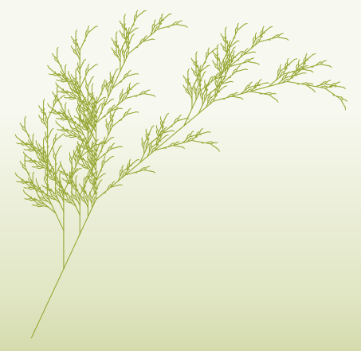

### Lindenmayer Systems

[Lindemayer Systems](https://en.wikipedia.org/wiki/L-system), or more commonly *L-Systems*, are a formalized language for modeling agent-based growth — especially for simulating cellular or floral growth and goal-seeking behaviors. They are used heavily by the cinematic and effects industries for quickly modeling plant- and coral-like beings, and by scientists studying self-similar and recursive systems like fractals, contagion and epidemic spread, and human consumption and population growth patterns.

An agent, often called for unknown reasons a *turtle*, is stationed at an origin point and is allowed to move in any direction defined in a [Euler Angle-based](https://en.wikipedia.org/wiki/Euler_angles) coordinate system (like an airplane -- pitch, yaw, roll).

The turtle follows an encoded set of directions...

```
F move forward at distance L(Step Length) and draw a line
f move forward at distance L(Step Length) without drawing a line
+ turn left A(Default Angle) degrees
– turn right A(Default Angle) degrees
roll left A(Default Angle) degrees
/ roll right A(Default Angle) degrees
^ pitch up A(Default Angle) degrees
& pitch down A(Default Angle) degrees
| turn around 180 degrees
J insert point at this position
“ multiply current length by dL(Length Scale)
! multiply current thickness by dT(Thickness Scale)
[ start a branch(push turtle state)
] end a branch(pop turtle state)
A/B/C/D.. placeholders, used to nest other symbols
```

The turtle is given a starting pattern (its *axiom*), a set of rules to follow, and a number of iterations to complete.

```
Axiom: FA
Rule 1: A = +F-FA 
Iterations: 3
```

The turtle will, for each iteration, follow the rules. At the end, all replacement symbols are dropped.

```
Iteration 0 : FA
Iteration 1 : F+F-FA
Iteration 2 : F+F-F+F-FA
Iteration 3 : F+F-F+F-F+F-FA
Final Pattern : F+F-F+F-F+F-F
```

We can set `F` equal to `move one unit forward`, `+` to `turn right 90 degrees`, and `-` to `turn left 90 degrees`.

The turtle now is walking in a stair step pattern toward the upper right. 

---

An Example from Wikipedia for modeling Sierpinski Fractals

```
Axiom  : A
Rule 1 : A = BF−AF−BF
Rule 2 : B = AF+BF+AF

+ : Turn Clockwise 60 degrees
- : Turn Counter-Clockwise 60 Degrees
F : Move Forward One Unit
```

Here is the results at different iteration counts (2,4,6,8)


---

More complex patterns, especially those invoking scale change and randomness, can create beautiful, organic, recursively complex results. These forms and patterns have compelling properties -- their self similarity means that scale change does not induces linear and predictable performative change. They often also offer unique, highly structural properties with minimal material use. Complexity builds quickly, however.

Again, from Wikipedia...

```
Axiom : X
Rule 1 : X = F[−X][X]F[−X]+FX

+ : Turn Clockwise 25 degrees
− : Turn Counter-Clockwise 25 degrees
[ : Remember Turtle Position 
] : Go Back to Last Remembered Turtle Position
F : Go Forward (1 / Iteration Count) Units
```



---

##### Readings on L-Systems

- [Algorithmic Beauty of Plants](http://algorithmicbotany.org/papers/#abop)
- [Algorithmic Botany (most useful link from above)](http://algorithmicbotany.org/papers/abop/abop-ch1.pdf)
- [Python Implementation](http://www.4dsolutions.net/ocn/lsystems.html)
- [L-System Solids](http://blog.rabidgremlin.com/2014/12/09/procedural-content-generation-l-systems/)
- [Modified Standards for Curve Drawing](http://www.evsc.net/projects/l-garden)
- [3D Fractals](http://williamchyr.com/2012/01/32-l-systems/)
- [Tree Generation for Videogames](https://www.youtube.com/watch?v=gHAqJY48p3Y)
- [In OpenGL](https://www.youtube.com/watch?v=AXDl3rlaHUw)

- [Rabbit, a Grasshopper Implementation that does not work on the Mac](https://morphocode.com/intro-to-l-systems/)
- [Culebra, a Grasshopper Implementation that does not work on the Mac](http://www.food4rhino.com/app/culebra)
- [Physarealm, a Grasshopper Implementation that does not work on the Mac](http://www.food4rhino.com/app/physarealm)
